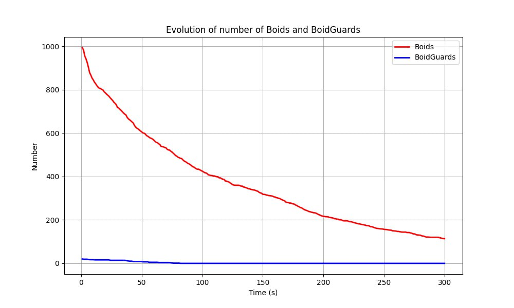

# escaping-from-christmas-market

This is the repository of the project "Escaping from chistmas market", for the course "Bio-Inspired Artificial Intelligence", University of Trento, AY 2024/2025.
This project aims to simulate the behavior of people during an evacuation, using Boid Algorithm. The map in this repository refers to the christmas markets in 'Piazza di Fiera', Trento, Italy. However, this code works also with other maps, after completing the necessary configuration. 

### Project Structure

The repository is organized as follows:

```
.
├── data
│   ├── Map_WITH_obstacle.png
│   ├── Map_WO_obstacle.png
├── src
│   ├── boid.py
│   ├── boidguard.py
│   ├── rules.py
│   ├── test.py
├── utils
│   ├── config.yaml
│   ├── create_result.py
│   ├── requirements.txt
│   ├── utils.py
└── README.md
```

### Setting the configuration file
The `config.yaml` file contains all the necessary parameters for configuring the environment and image-related settings. It is used for adjusting key features of the image and the simulation process.

##### Image Parameters:

- **height**: Defines the height of the image (default is 720 pixels).
- **width**: Defines the width of the image (default is 557 pixels).
- **path**: The file path to the image used in the simulation. 

##### Colors:
These values define the RGB color values and their corresponding hex codes for various elements in the image:

- **obstacle**: the colour of the obstacle that boids must avoid.
- **border**: the colour of the border, usually is the same as the one of the obstacle.
- **target**: the colour of the target position.

##### Parameters:
These settings control the behavior of boids.
- **alignment**: (default: 0.5) Controls the tendency of boids to align with their neighbors.
- **cohesion**: (default: 0.3) Controls how much boids will move towards the center of the group.
- **separation**: (default: 0.8) Controls the tendency of boids to avoid crowding and maintain personal space.

##### People:
- **num**: Number of boids in the simulation, corresponding to the number of people.

##### Security:
- **percentage**: Number of boidGuards in the simulation. BoidGuards are particular boids that are 
aware of the target's position (safety exits) and act as security guides, helping direct other agents towards the target.

### How to run the project
First, make sure you have all the necessary libraries installed by running:

   ```bash
   pip install -r requirements.txt
   ```


After having completed the configuration process, it is possible to run the simulation:

   ```bash
   python ./srs/test.py 
   ```

### Results
For each run, results are saved in a csv file, inside the  `result ` folder (created by  `create_results.py `).
The file is named  `result-[num_boids]-[num-boidguards].csv`. It contains the couples (boids_still_inside , boidguards_still_inside).
These values are recorded every 30 seconds over a total duration of 5 minutes.
Additionally, a plot is generated showing the number of boids and BoidGuards remaining in the map over time. Below is an example:



### Authors
This project was created by:
 - Agnese Cervino - [@AgneCer](https://github.com/AgneCer)
 - Maria Amalia Pelle - [@pariamelle](https://github.com/pariamelle)
 - Gaia Pizzuti - [@GaiaPizzuti](https://github.com/GaiaPizzuti)